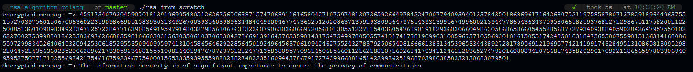

# RSA Algorithm from scratch

This is a project for <i>Advanced Network Concepts</i> for computer engineering classes

## How to run :scroll:

### Pre-Compiled binaries
There are compiled binaries to 64 bits architecture for _WINDOWS_, _LINUX_ and _MAC_ just execute it from your prefered terminal.

Linux expected output example:
<h2 align="center">
    
</h2>

### With go binaries
  - `make run` or `go run main.go rsa.go`
